# 공지드롭

> 매번 놓치는 공지사항, 무한 새로 고침은 이제 그만!
> **공지드롭**이 여러분이 기다리는 새로운 공지 소식을 알려드릴게요 💌
> with [비사이드 - 포텐데이](https://bside.best/potenday)

***[서비스 보러가기 ✨](https://tenplestay.kro.kr)***
구체적인 내용을 알고 싶다면? [🔖 서비스 소개 노션 페이지](https://nuung.notion.site/5951b8af10ac4b86bf33150b36045549?pvs=4)

## 1. Getting started

### 1) backend

1. poetry 세팅 필요 - [how to setup poetry?](https://velog.io/@qlgks1/python-poetry-%EC%84%A4%EC%B9%98%EB%B6%80%ED%84%B0-project-initializing-%ED%99%9C%EC%9A%A9%ED%95%98%EA%B8%B0)
2. check out the `pyproject.toml` and `.python-version`
3. run `poetry install`
4. `cp /backend/.env-sample /backend/.env` for set up the environment variable
5. go migration, `python manage.py migrate`
6. run `python manage.py run`

### 2) frontend

- vite 사용

1. `npm install`
2. `cp /frontend/.env-sample /frontend/.env` for set up the environment variable
3. `npm run dev`
4. `npm run build`

### 3) Infra

### 4) 크로바 사용 코어 로직

```mermaid
flowchart TB
    A[시작] --> B[1. Retry Session으로 HTTP 요청]
    B --> C[2. 정적 HTML 문서 파싱]
    C --> D[3. ClovaStudio 요약 및 핵심 키워드 추출 API 사용]
    D --> E[결과 반환]
    D --> |시간 초과 또는 불가능| F[4. HTML에서 문자 데이터 파싱 및 전처리]
    F --> G[5. langdetect 라이브러리로 언어 감지]
    G --> |한글| H[6. KoNLPy 라이브러리로 형태소 분석 및 상위 키워드 추출]
    G --> |영문| I[7. NLTK 라이브러리로 토큰화 및 상위 5개 키워드 추출]
    H --> J[결과 반환]
    I --> J
```

